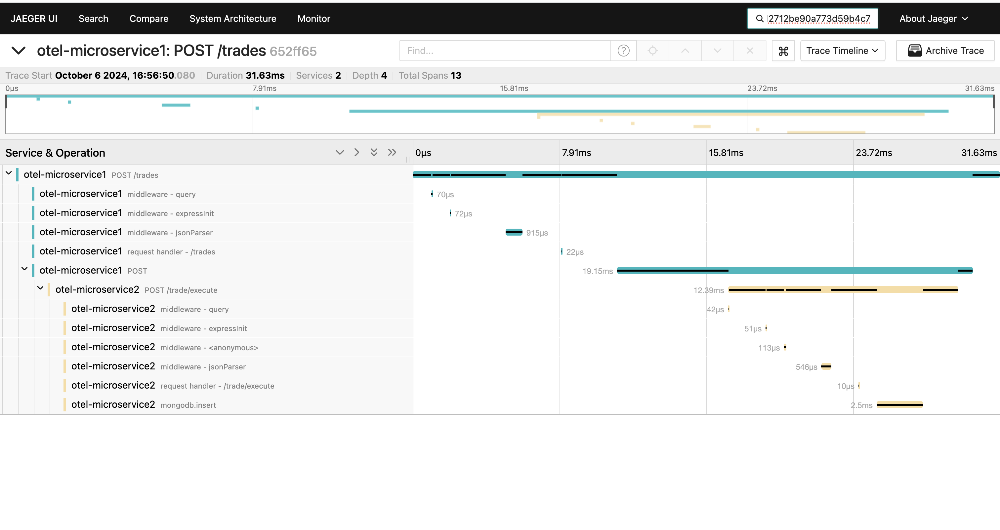

# otel-jaegar-demo
OTEL implementation for microservices using OSS Jaegar for tracing.


## Prerequisites
 - MongoDB 7
 - Docker

## Setup
Microservices
  - `npm run build`
  - `npm run start:server1`
  - `npm run start:server2`

## Generate Traces
``` bash
while true; do curl --location 'http://localhost:3000/trades' \
--header "x-correlation-id: $(date +%s)" \
--header 'Content-Type: application/json' \
--data '{
    "scrip": "REL",
    "qty": 10,
    "type": "BUY",
    "orderType": "MARKET"
}'; sleep 1; done
```

## Find Trace using traceID



## Dashboard
Visit: http://localhost:16686/search
